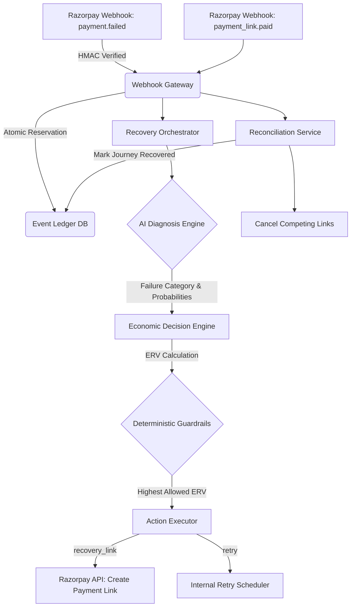

# RecoverOS Architecture

The architecture of RecoverOS is fundamentally designed around **Production Safety, Observability, and Economic Intelligence**. It is not an AI prototype; it is a deterministic state machine that uses AI strictly as an unprivileged heuristic engine.

## Core Tenets

1. **AI Has No Execution Authority:** AI models (LLMs) hallucinate. RecoverOS strictly limits the AI to a Diagnosis Provider. It outputs probabilities. A deterministic rule-based Decision Engine translates those probabilities into actions.
2. **Idempotency is Mandatory:** Financial webhooks can be duplicated or re-delivered. RecoverOS relies on SQLite atomic unique constraints (`webhook_event_id`) to ensure webhooks are processed exactly once.
3. **Economic Decision Making:** The best recovery action isn't always the one with the highest success probability. ERV (Expected Recovery Value) ensures we never spend ₹30 to recover ₹10, and we never burn customer trust for low-probability returns.

## Component Flow

## System Components

### 1. Webhook Gateway (`routes_webhooks.py`)
Responsible for ingesting Razorpay webhooks. It performs HMAC-SHA256 signature verification immediately. If valid, it enforces atomic idempotency by inserting the `webhook_event_id` into the `webhook_events` table. If the insert fails due to a unique constraint, the webhook is dropped as a duplicate.

### 2. Diagnosis Engine (`diagnosis_engine.py`)
Interfaces with an AI Provider (Mock or Google Gemini). Given the raw failure context, it strictly maps the error to a standardized failure category and predicts the probability of success for every possible intervention (e.g., `payment_link`, `retry`). **It has absolutely no authority to move money.**

### 3. Economic Decision Engine (`decision_engine.py`)
Calculates the Expected Recovery Value (ERV) for each action.
`ERV = (Probability * Recoverable Amount) - Direct Cost - Customer Friction Penalty`
The Decision Engine also performs a **Counterfactual Simulation** to calculate the economic advantage generated over the "Next Best Action."

### 4. Guardrail Engine (`guardrails.py`)
Acts as the final safety net. It deterministically filters out candidate actions that violate business constraints (e.g., negative ERV, duplicate actions, high-fatigue limits, AI low-confidence).

### 5. Action Executor (`action_executor.py`)
The only component authorized to interact with Razorpay APIs or dispatch recovery actions:
- **Live Razorpay Test Mode REST API:** Creates hosted Payment Links (`POST /v1/payment_links`) and cancels active links (`POST /v1/payment_links/{id}/cancel`).
- **Recommendation-Only Capability:** `payment_method_update` generates customer update guidance and simulated session tokens (as public sandbox lacks direct mandate update endpoints).
- **Simulated Recovery Actions:** `retry_now`, `retry_later`, `send_reminder`, and `escalate_human` are executed via deterministic internal state machine simulations.

### 6. Reconciliation Service (`reconciliation_service.py`)
Listens for settlement webhooks (`payment_link.paid`, `payment.captured`). It atomically maps the settlement back to the original recovery journey, marks it `RECOVERED`, records the net value, and actively enqueues the cancellation of any competing active payment links to prevent double-charging.

## Why AI Does Not Execute Money Actions

A naive approach to AI payment recovery is an "Autonomous Agent" that iterates through actions via function calling. This is highly dangerous in a financial setting.
If the AI is compromised via prompt injection (e.g., a user's name is "DROP TABLE"), or if the AI simply hallucinates, it could endlessly issue refunds or create spam payment links.

RecoverOS enforces a hard boundary:
- **The AI thinks (Probabilities).**
- **The code decides (ERV & Guardrails).**
- **The code acts (Action Executor).**
