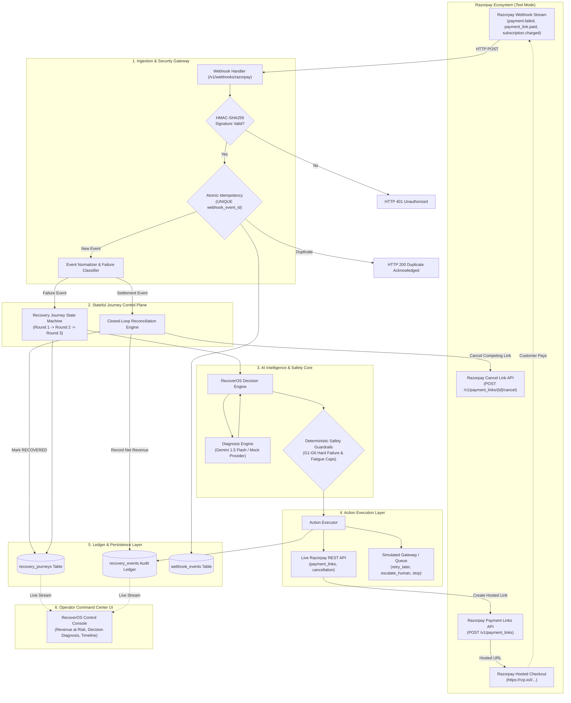
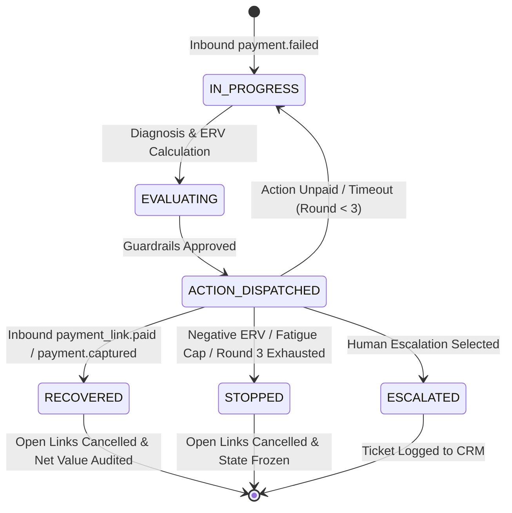

# RecoverOS — System Architecture & Technical Specification

RecoverOS is a **Razorpay-native payment recovery control plane** that transforms dunning from static retry rules into **dynamic economic decision-making**.

It operates as a deterministic state machine that uses AI strictly as an unprivileged diagnosis engine, combining continuous Expected Recovery Value (ERV) optimization with deterministic safety guardrails and closed-loop Razorpay reconciliation.

---

## 1. Core Architectural Tenets

1. **AI Has Zero Execution Authority:** AI models predict probabilities and categorize root causes; they never execute API calls or mutate state directly. A deterministic Economic Decision Engine applies guardrails and translates diagnoses into actions.
2. **Idempotency & Replay Protection:** Webhooks are signature-verified via HMAC-SHA256 and filtered through database `UNIQUE` constraints on `webhook_event_id` and timestamp tolerance checks to guarantee exactly-once processing.
3. **Economic Decision Optimization (ERV):** Interventions are selected to maximize Expected Recovery Value:
   $$\text{ERV} = (\text{Predicted Probability} \times \text{Invoice Amount}) - \text{Action Cost} - \text{Customer Friction Penalty}$$
   If all candidate ERVs are non-positive or violate fatigue limits, the system safely halts (`stop`).
4. **Closed-Loop Reconciliation:** Every recovery action correlates to a settlement lifecycle. Upon payment capture, competing payment links and future dunning attempts are automatically cancelled to prevent double-charging.

---

## 2. End-to-End System Architecture

---

## 3. Subsystem Components & Responsibilities

### 1. Webhook Gateway (`routes_webhooks.py`)
- Ingests inbound webhooks from Razorpay.
- Computes `HMAC-SHA256(body, webhook_secret)` and compares against `X-Razorpay-Signature`.
- Enforces replay protection (rejecting events older than configured tolerance).
- Enforces atomic idempotency by attempting a database reservation (`webhook_events` table). Duplicate deliveries return HTTP 200 without re-executing actions.

### 2. Diagnosis Engine (`diagnosis_engine.py` & `llm_provider.py`)
- Interfaces with Google Gemini 1.5 Flash (or deterministic Mock Provider).
- Given unstructured failure descriptions and customer history, maps errors to standardized failure categories (`insufficient_funds`, `bank_timeout`, `expired_card`, `hard_decline`, `fraud_suspected`).
- Outputs strict JSON probability distributions for intervention channels.
- **Zero execution privileges:** Cannot mutate database records or invoke external payment rails.

### 3. Economic Decision Engine (`decision_engine.py`)
- Evaluates all 7 candidate recovery actions against the invoice amount.
- Calculates ERV per action factoring in direct API costs and customer friction costs.
- Calculates **Counterfactual Advantage**: the rupee difference between the selected action's ERV and the next-best fallback.
- Applies AI confidence overrides: if AI confidence $< 0.60$, automated financial actions are suppressed in favor of safe human escalation or halt.

### 4. Guardrail Engine (`guardrails.py`)
Deterministic business, risk, and regulatory guardrails executed before any action is permitted:
- **G1 (Negative ERV Suppression):** Suppresses any non-escalation action with $\text{ERV} \le 0$.
- **G2 (Permanent Failure Retry Suppression):** Blocks automated retries on permanent failures (`expired_card`, `hard_decline`, `invalid_payment_method`).
- **G3 (Micro-Invoice Human Cap):** Prohibits ₹30.00 human escalation for invoices $< \text{₹}100.00$.
- **G4 (Customer Fatigue & Dunning Cap):** Halts retries and reminders when contact count $\ge 5$ or attempt count $\ge 5$.
- **G5 (Degraded State Fallback):** Reverts to safe human escalation (high value) or reminder (low value) without financial risk if scoring is unavailable.
- **G6 (Halted Subscription Safety):** Blocks generic retries on `subscription.halted`, requiring explicit payment method updates or human review.

### 5. Action Executor (`action_executor.py` & `razorpay_client.py`)
- The single authorized dispatcher for recovery actions.
- Genuinely calls Razorpay Test Mode REST API (`POST /v1/payment_links`, `POST /v1/payment_links/{id}/cancel`) when live execution is enabled.
- Runs deterministic local state machine simulations in default offline mode.

### 6. Reconciliation Service (`reconciliation_service.py` & `journey_service.py`)
- Correlates settlement webhooks (`payment_link.paid`, `payment.captured`, `subscription.charged`) to open journeys.
- Handles out-of-order webhooks safely: if a settlement arrives before failure ingestion completes, it queues in a `pending_settlements` table and atomically resolves upon journey creation.
- Automatically issues cancellation for open payment links when a competing payment is detected.

---

## 4. Razorpay Webhook Ingestion & API Audit

| Webhook Event | Payload Entity | Role in RecoverOS | Lifecycle Action |
|---|---|---|---|
| `payment.failed` | `payload.payment.entity` | Primary revenue-at-risk trigger | Initializes or advances `RecoveryJourney` |
| `subscription.pending` | `payload.subscription.entity` | Secondary recurring failure signal | Updates retry schedule and dunning round |
| `subscription.halted` | `payload.subscription.entity` | Terminal gateway failure alert | Triggers G6 guardrail (escalate or stop) |
| `subscription.charged` | `payload.subscription.entity` | Recurring settlement confirmation | Marks journey **RECOVERED**, cancels open links |
| `payment.captured` | `payload.payment.entity` | Standard invoice settlement confirmation | Marks journey **RECOVERED**, logs net value |
| `payment_link.paid` | `payload.payment_link.entity` | Hosted checkout link settlement | Marks journey **RECOVERED**, logs net value |
| `payment_link.cancelled` | `payload.payment_link.entity` | Cancellation confirmation | Updates audit ledger (neutral event) |

---

## 5. Action Capability & Execution Classification

| Action Name | Execution Classification | Gateway / Channel Mapping | Action Cost (₹) | Friction Cost (₹) | Behavior & Feasibility |
|---|---|---|---|---|---|
| **`recovery_link`** | **Live Razorpay REST API** | `POST /v1/payment_links` & `payment_link.paid` | ₹1.50 | ₹5.00 | Creates hosted checkout link (`https://rzp.io/i/...`). Live interactive payment demonstrable in sandbox. |
| **`payment_method_update`** | **Recommendation-Only** | Simulated customer update session token | ₹2.00 | ₹25.00 | Generates customer portal guidance to update card/mandate without subscription cancellation. |
| **`retry_now`** | **Simulated Re-Auth** | Immediate backend authorization attempt | ₹1.00 | ₹2.00 | Used for transient bank timeouts (`bank_timeout`). Suppressed on hard failures. |
| **`retry_later`** | **Internal Queue Delay** | Scheduled off-peak retry queue (48-72h) | ₹1.00 | ₹2.00 | Optimizes retry timing around salary credit windows for `insufficient_funds`. |
| **`send_reminder`** | **Notification Simulation** | SMS / WhatsApp notification payload | ₹0.50 | ₹10.00 | Low-cost dunning message with one-click payment URL. |
| **`escalate_human`** | **CRM Ticket Dispatcher** | Priority support concierge dispatch | ₹30.00 | ₹5.00 | Reserved for high-CLV accounts or persistent multi-round failures. |
| **`stop`** | **Link Cancel & State Halt** | `POST /v1/payment_links/{id}/cancel` | ₹0.00 | ₹0.00 | Terminates dunning when ERV is non-positive or fatigue cap is reached; cancels open links. |

---

## 6. Closed-Loop Recovery Journey State Machine

---

## 7. Fault Tolerance & Degraded States

1. **AI Provider Outage / Timeout:** If the AI provider times out (5.0s) or fails JSON validation, `DiagnosisEngine` seamlessly falls back to deterministic safe defaults (`confidence=0.1`, `unknown` category), routing execution through deterministic guardrails without blocking money movement.
2. **Razorpay API Downtime:** If Razorpay returns HTTP 502/503/504, `RazorpayTestClient` catches the error, marks the execution status as `EXECUTION_UNKNOWN` or `GATEWAY_DOWN`, and protects the ledger from state corruption.
3. **Out-of-Order Delivery:** Settlement webhooks arriving before failure events are held in `pending_settlements` and reconciled atomically as soon as the journey entity is initialized.
