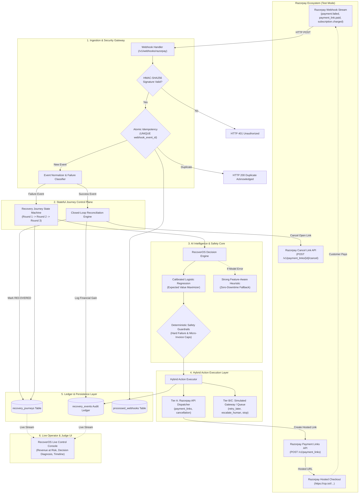

# RecoverOS Phase 3 — Architecture & Data Flow Specification

**Document Version:** 1.0.0  
**Target:** Razorpay AI Buildathon — Track 03: AI Revenue Recovery  
**Focus:** Architectural layout, data pipeline, component boundaries, and security design.

---

## 1. End-to-End System Architecture

---

## 2. Component Breakdown: Existing vs. To Be Built

| Component | Status | Location in Codebase | Phase 3 Enhancement / Role |
|---|---|---|---|
| **HMAC Signature Verifier** | Existing | `backend/app/services/razorpay_adapter.py` | Verify inbound Razorpay payloads with secret key. |
| **Atomic Idempotency** | Existing | `backend/app/models/database.py` | Prevent duplicate webhook processing via unique constraints. |
| **Error Code Normalizer** | Existing | `backend/app/services/razorpay_adapter.py` | Maps gateway error codes to 9 normalized failure categories. |
| **ML Decision Engine** | Existing | `backend/app/services/decision_engine.py` | Evaluates 7 candidate actions via calibrated ERV. |
| **Deterministic Guardrails** | Existing | `backend/app/services/guardrails.py` | Enforces hard failure retry suppression & micro-invoice caps. |
| **Feature-Aware Heuristic** | Existing | `evaluation/policies/feature_aware_heuristic.py` | Embed as zero-downtime fallback when model inference is degraded. |
| **Stateful Journey Engine** | **To Be Built** | `backend/app/services/journey_service.py` | Manage multi-round state (R1 -> R2 -> R3) in the database. |
| **Closed-Loop Reconciler** | **To Be Built** | `backend/app/services/reconciliation_service.py` | Auto-match settlement webhooks, cancel open links, mark recovered. |
| **Live Payment Links Client** | Existing / Upgrade | `backend/app/services/razorpay_client.py` | Connect to live Razorpay Test Mode REST API endpoints. |
| **Live Operator Console UI** | **To Be Built** | `frontend/` or standalone live dashboard | Provide clean visual timeline of revenue at risk, decisions, and audit trail. |

---

## 3. Reliability, Safety & Failure Modes

1. **Zero-Downtime Heuristic Fallback:**
   If the ML model artifact fails to load, times out, or encounters unexpected missing features, the Decision Engine automatically falls back to the **Strong Feature-Aware Heuristic**, ensuring recovery decisions are never dropped or blocked.
2. **Razorpay Gateway Timeout Handling:**
   If Razorpay's API encounters a 504 Gateway Timeout or 503 Unavailable during payment link creation, the action is marked `EXECUTION_PENDING_RETRY` in the ledger and queued for safe retry without duplicating state.
3. **Double-Payment Prevention:**
   When a recovery event is confirmed via `payment.captured` or `payment_link.paid`, the Closed-Loop Reconciler immediately issues a `POST /v1/payment_links/{id}/cancel` call for any open links associated with that transaction.
4. **Data Privacy & Identifier Protection:**
   Transaction and customer identifiers are hashed in client-facing logs. No raw card numbers or CVVs ever touch RecoverOS servers (all checkout interaction occurs on Razorpay's PCI-DSS compliant hosted pages).
